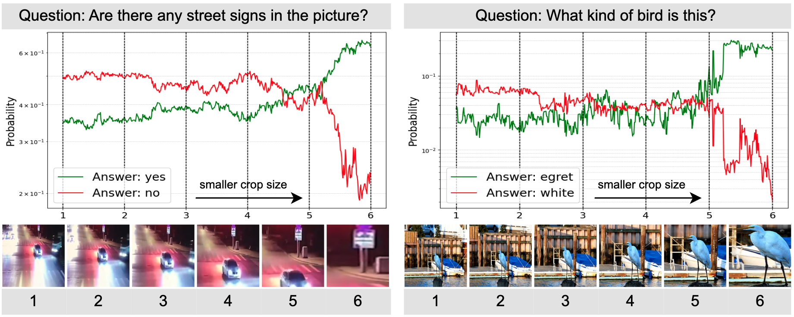
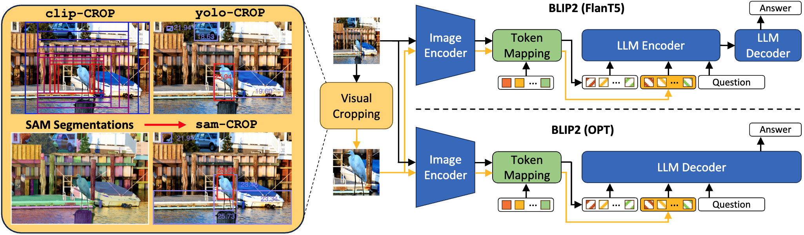

# Visual Cropping Improves Zero-Shot Question Answering of Multimodal Large Language Models

[Jiarui Zhang](https://saccharomycetes.github.io/), [Mahyar Khayatkhoei](https://scholar.google.com/citations?user=ikhxY4YAAAAJ&hl=en), [Prateek Chhikara](https://www.prateekchhikara.com/), [Filip Ilievski](https://www.ilievski.info/)

[[`Paper`]](https://arxiv.org/abs/2310.16033)


## Introduction

In this work, we investigate whether multimodal LLMs can perceive small details as well as large details in images. In particular, we show that their zero-shot accuracy in answering visual questions is very sensitive to the size of the visual subject of the question, declining up to $46\%$ with size. Furthermore, we show that this effect is causal by observing that human visual cropping can significantly mitigate their sensitivity to size. Inspired by the usefulness of human cropping, we then propose three automatic visual cropping methods as inference time mechanisms to improve the zero-shot performance of multimodal LLMs. We study their effectiveness on four popular VQA datasets, and a subset of the VQAv2 dataset tailored towards fine visual details. Our findings suggest that **multimodal LLMs should be used with caution in detail-sensitive VQA applications**, and that **visual cropping is a promising direction to improve their zero-shot performance.**




## Testing Cropping Methods and See How Cropping helps BLIP2 Answer Question Better

(optional) Create a conda environment and activate it.

```
conda create -n visual_crop_zsvqa python=3.8
conda activate visual_crop_zsvqa
```

Clone the repoisitory

```
git clone https://github.com/saccharomycetes/visual_crop_zsvqa.git
cd visual_crop_zsvqa
```

Since we have made a modification to the original [LAVIS](https://github.com/salesforce/LAVIS) library, please use the following command to install the modified LAVIS library.

```
cd LAVIS
pip install -e .
```

Then install the rest of the dependencies.

```
cd ..
pip install -r requirements.txt
``````

Download the model checkpoints

SAM model checkpoint [here](https://dl.fbaipublicfiles.com/segment_anything/sam_vit_h_4b8939.pth)

YOLO model checkpoint [here](https://github.com/ultralytics/assets/releases/download/v0.0.0/yolov8x.pt)

Or you can download them using the following command

```
wget https://dl.fbaipublicfiles.com/segment_anything/sam_vit_h_4b8939.pth
wget https://github.com/ultralytics/assets/releases/download/v0.0.0/yolov8x.pt
```

Now you will be ready to run the `crop.ipynb` to see how cropping helps BLIP2 answer question better.

## Citation

If you find our research to be useful or insightful, please consider citing the following paper:

```bibtex
@article{zhang2023visual,
  title={Visual Cropping Improves Zero-Shot Question Answering of Multimodal Large Language Models},
  author={Zhang, Jiarui and Khayatkhoei, Mahyar and Chhikara, Prateek and Ilievski, Filip},
  journal={arXiv preprint arXiv:2310.16033},
  year={2023}
}
```

## Contact

-   `jrzhang [AT] isi.edu`